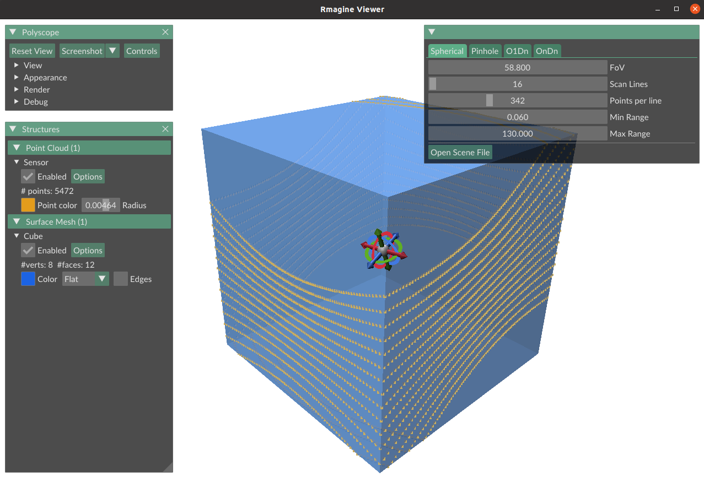

# rmagine_viewer


A viewer to demonstrate the basic functionalities of the [rmagine](https://github.com/uos/rmagine) library. Currently, only the Embree backend of rmagine is supported. Make sure Embree is installed properly. 

## Requirements

- Embree (>= v4.0.0)
- jsoncpp
- cmake >= 3.11

## Building

```console
git clone https://github.com/amock/rmagine_viewer.git
cd rmagine_viewer
mkdir build
cd build
cmake ..
cmake --build .
```

<details>
<summary>
Output on my machine:
</summary>

```console
amock@amockhome:~$ git clone https://github.com/amock/rmagine_viewer.git
Cloning into 'rmagine_viewer'...
remote: Enumerating objects: 12, done.
remote: Counting objects: 100% (12/12), done.
remote: Compressing objects: 100% (9/9), done.
remote: Total 12 (delta 1), reused 0 (delta 0), pack-reused 0 (from 0)
Receiving objects: 100% (12/12), 8.20 KiB | 8.20 MiB/s, done.
Resolving deltas: 100% (1/1), done.
amock@amockhome:~$ cd rmagine_viewer/
amock@amockhome:~/rmagine_viewer$ mkdir build
amock@amockhome:~/rmagine_viewer$ cd build/
amock@amockhome:~/rmagine_viewer/build$ cmake ..
-- The C compiler identification is GNU 9.4.0
-- The CXX compiler identification is GNU 9.4.0
-- Check for working C compiler: /usr/bin/cc
-- Check for working C compiler: /usr/bin/cc -- works
-- Detecting C compiler ABI info
-- Detecting C compiler ABI info - done
-- Detecting C compile features
-- Detecting C compile features - done
-- Check for working CXX compiler: /usr/bin/c++
-- Check for working CXX compiler: /usr/bin/c++ -- works
-- Detecting CXX compiler ABI info
-- Detecting CXX compiler ABI info - done
-- Detecting CXX compile features
-- Detecting CXX compile features - done
-- Populating rmagine
-- Configuring done
-- Generating done
-- Build files have been written to: /home/amock/rmagine_viewer/build/_deps/rmagine-subbuild
Scanning dependencies of target rmagine-populate
[ 11%] Creating directories for 'rmagine-populate'
[ 22%] Performing download step (git clone) for 'rmagine-populate'
Cloning into 'rmagine-src'...
remote: Enumerating objects: 7004, done.        
remote: Counting objects: 100% (1119/1119), done.        
remote: Compressing objects: 100% (416/416), done.        
remote: Total 7004 (delta 640), reused 1075 (delta 615), pack-reused 5885 (from 1)        
Receiving objects: 100% (7004/7004), 2.93 MiB | 6.68 MiB/s, done.
Resolving deltas: 100% (4659/4659), done.
Switched to a new branch 'develop'
Branch 'develop' set up to track remote branch 'develop' from 'origin'.
[ 33%] No patch step for 'rmagine-populate'
[ 44%] Performing update step for 'rmagine-populate'
Current branch develop is up to date.
[ 55%] No configure step for 'rmagine-populate'
[ 66%] No build step for 'rmagine-populate'
[ 77%] No install step for 'rmagine-populate'
[ 88%] No test step for 'rmagine-populate'
[100%] Completed 'rmagine-populate'
[100%] Built target rmagine-populate
-- CMake Version: 3.16.3
-- >= 3.9 - Enabling Link Time Optimization
-- Found Boost: /usr/lib/x86_64-linux-gnu/cmake/Boost-1.71.0/BoostConfig.cmake (found version "1.71.0")  
CMake Warning (dev) at /usr/lib/x86_64-linux-gnu/cmake/assimp-5.0/assimpTargets.cmake:54 (if):
  if given arguments:

    "ON"

  An argument named "ON" appears in a conditional statement.  Policy CMP0012
  is not set: if() recognizes numbers and boolean constants.  Run "cmake
  --help-policy CMP0012" for policy details.  Use the cmake_policy command to
  set the policy and suppress this warning.
Call Stack (most recent call first):
  /usr/lib/x86_64-linux-gnu/cmake/assimp-5.0/assimp-config.cmake:1 (include)
  build/_deps/rmagine-src/CMakeLists.txt:102 (find_package)
This warning is for project developers.  Use -Wno-dev to suppress it.

-- Found OpenMP_C: -fopenmp (found version "4.5") 
-- Found OpenMP_CXX: -fopenmp (found version "4.5") 
-- Found OpenMP: TRUE (found version "4.5")  
-- Looking for pthread.h
-- Looking for pthread.h - found
-- Performing Test CMAKE_HAVE_LIBC_PTHREAD
-- Performing Test CMAKE_HAVE_LIBC_PTHREAD - Failed
-- Looking for pthread_create in pthreads
-- Looking for pthread_create in pthreads - not found
-- Looking for pthread_create in pthread
-- Looking for pthread_create in pthread - found
-- Found Threads: TRUE  
-- Found CUDA: /usr/local/cuda (found version "11.4") 
-- The CUDA compiler identification is NVIDIA 11.4.152
-- Check for working CUDA compiler: /usr/local/cuda/bin/nvcc
-- Check for working CUDA compiler: /usr/local/cuda/bin/nvcc -- works
-- Detecting CUDA compiler ABI info
-- Detecting CUDA compiler ABI info - done
-- Found PkgConfig: /usr/bin/pkg-config (found version "0.29.1") 
-- FindOptiX: Found path to optix headers in environment variable 'OPTIX_INCLUDE_DIR'. 
-- Include: /home/amock/software/libraries/optix/NVIDIA-OptiX-SDK-7.3.0-linux64-x86_64/include
-- Building Core. Library: rmagine
-- Building Core. Library: rmagine
-- Building Embree (4.3.1) backend. Library: rmagine-embree
-- Building Cuda dependend code. Library: rmagine-cuda
-- Building OptiX (7.3.0) backend. Library: rmagine_optix
-- Components build:
-- - rmagine-core
-- - rmagine-ouster
-- - rmagine-embree
-- - rmagine-cuda
-- - rmagine-optix
-- Building tests for Rmagine core
-- Building tests for Embree backend
-- Building tests for OptiX backend
-- Populating polyscope
-- Configuring done
-- Generating done
-- Build files have been written to: /home/amock/rmagine_viewer/build/_deps/polyscope-subbuild
Scanning dependencies of target polyscope-populate
[ 11%] Creating directories for 'polyscope-populate'
[ 22%] Performing download step (git clone) for 'polyscope-populate'
Cloning into 'polyscope-src'...
remote: Enumerating objects: 10461, done.        
remote: Counting objects: 100% (3082/3082), done.        
remote: Compressing objects: 100% (686/686), done.        
remote: Total 10461 (delta 2589), reused 2610 (delta 2324), pack-reused 7379 (from 1)        
Receiving objects: 100% (10461/10461), 23.57 MiB | 6.97 MiB/s, done.
Resolving deltas: 100% (7466/7466), done.
Already on 'master'
Your branch is up to date with 'origin/master'.
Submodule 'deps/glfw' (https://github.com/glfw/glfw.git) registered for path 'deps/glfw'
Submodule 'deps/glm' (https://github.com/g-truc/glm.git) registered for path 'deps/glm'
Submodule 'deps/happly' (https://github.com/nmwsharp/happly.git) registered for path 'deps/happly'
Submodule 'deps/imgui/imgui' (https://github.com/ocornut/imgui.git) registered for path 'deps/imgui/imgui'
Cloning into '/home/amock/rmagine_viewer/build/_deps/polyscope-src/deps/glfw'...
Cloning into '/home/amock/rmagine_viewer/build/_deps/polyscope-src/deps/glm'...
Cloning into '/home/amock/rmagine_viewer/build/_deps/polyscope-src/deps/happly'...
Cloning into '/home/amock/rmagine_viewer/build/_deps/polyscope-src/deps/imgui/imgui'...
Submodule path 'deps/glfw': checked out 'e2c92645460f680fd272fd2eed591efb2be7dc31'
Submodule path 'deps/glm': checked out '0af55ccecd98d4e5a8d1fad7de25ba429d60e863'
Submodule path 'deps/happly': checked out '88f79725d32d78e0e637ebf42d8432d519e1c7d0'
Submodule path 'deps/imgui/imgui': checked out '277ae93c41314ba5f4c7444f37c4319cdf07e8cf'
[ 33%] No patch step for 'polyscope-populate'
[ 44%] Performing update step for 'polyscope-populate'
Current branch master is up to date.
[ 55%] No configure step for 'polyscope-populate'
[ 66%] No build step for 'polyscope-populate'
[ 77%] No install step for 'polyscope-populate'
[ 88%] No test step for 'polyscope-populate'
[100%] Completed 'polyscope-populate'
[100%] Built target polyscope-populate
-- Using X11 for window creation
-- Found X11: /usr/include   
-- Looking for XOpenDisplay in /usr/lib/x86_64-linux-gnu/libX11.so;/usr/lib/x86_64-linux-gnu/libXext.so
-- Looking for XOpenDisplay in /usr/lib/x86_64-linux-gnu/libX11.so;/usr/lib/x86_64-linux-gnu/libXext.so - found
-- Looking for gethostbyname
-- Looking for gethostbyname - found
-- Looking for connect
-- Looking for connect - found
-- Looking for remove
-- Looking for remove - found
-- Looking for shmat
-- Looking for shmat - found
-- Looking for IceConnectionNumber in ICE
-- Looking for IceConnectionNumber in ICE - found
-- GLM: Version 1.0.1
-- GLM: Build with C++ features auto detection
Polyscope backend openGL3_glfw enabled
-- Looking for C++ include EGL/egl.h
-- Looking for C++ include EGL/egl.h - found
Polyscope backend openGL3_egl enabled
Polyscope backend openGL_mock enabled
-- Populating portable_file_dialogs
-- Configuring done
-- Generating done
-- Build files have been written to: /home/amock/rmagine_viewer/build/_deps/portable_file_dialogs-subbuild
Scanning dependencies of target portable_file_dialogs-populate
[ 11%] Creating directories for 'portable_file_dialogs-populate'
[ 22%] Performing download step (git clone) for 'portable_file_dialogs-populate'
Cloning into 'portable_file_dialogs-src'...
remote: Enumerating objects: 655, done.        
remote: Counting objects: 100% (274/274), done.        
remote: Compressing objects: 100% (106/106), done.        
remote: Total 655 (delta 171), reused 264 (delta 168), pack-reused 381 (from 1)        
Receiving objects: 100% (655/655), 172.86 KiB | 3.53 MiB/s, done.
Resolving deltas: 100% (407/407), done.
Already on 'main'
Your branch is up to date with 'origin/main'.
[ 33%] No patch step for 'portable_file_dialogs-populate'
[ 44%] Performing update step for 'portable_file_dialogs-populate'
Current branch main is up to date.
[ 55%] No configure step for 'portable_file_dialogs-populate'
[ 66%] No build step for 'portable_file_dialogs-populate'
[ 77%] No install step for 'portable_file_dialogs-populate'
[ 88%] No test step for 'portable_file_dialogs-populate'
[100%] Completed 'portable_file_dialogs-populate'
[100%] Built target portable_file_dialogs-populate
-- Configuring done
-- Generating done
-- Build files have been written to: /home/amock/rmagine_viewer/build
amock@amockhome:~/rmagine_viewer/build$ cmake --build .
Scanning dependencies of target stb
[  0%] Building CXX object _deps/polyscope-build/deps/stb/CMakeFiles/stb.dir/stb_impl.cpp.o
[  1%] Linking CXX static library libstb.a
[  1%] Built target stb
Scanning dependencies of target glad
[  1%] Building C object _deps/polyscope-build/deps/glad/src/CMakeFiles/glad.dir/glad.c.o
cc1: warning: command line option ‘-std=c++17’ is valid for C++/ObjC++ but not for C
[  1%] Linking C static library libglad.a
[  1%] Built target glad
Scanning dependencies of target glfw
[  2%] Building C object _deps/polyscope-build/deps/glfw/src/CMakeFiles/glfw.dir/context.c.o
cc1: warning: command line option ‘-std=c++17’ is valid for C++/ObjC++ but not for C
[  2%] Building C object _deps/polyscope-build/deps/glfw/src/CMakeFiles/glfw.dir/init.c.o
cc1: warning: command line option ‘-std=c++17’ is valid for C++/ObjC++ but not for C
[  2%] Building C object _deps/polyscope-build/deps/glfw/src/CMakeFiles/glfw.dir/input.c.o
cc1: warning: command line option ‘-std=c++17’ is valid for C++/ObjC++ but not for C
[  3%] Building C object _deps/polyscope-build/deps/glfw/src/CMakeFiles/glfw.dir/monitor.c.o
cc1: warning: command line option ‘-std=c++17’ is valid for C++/ObjC++ but not for C
[  3%] Building C object _deps/polyscope-build/deps/glfw/src/CMakeFiles/glfw.dir/vulkan.c.o
cc1: warning: command line option ‘-std=c++17’ is valid for C++/ObjC++ but not for C
[  4%] Building C object _deps/polyscope-build/deps/glfw/src/CMakeFiles/glfw.dir/window.c.o
cc1: warning: command line option ‘-std=c++17’ is valid for C++/ObjC++ but not for C
[  4%] Building C object _deps/polyscope-build/deps/glfw/src/CMakeFiles/glfw.dir/x11_init.c.o
cc1: warning: command line option ‘-std=c++17’ is valid for C++/ObjC++ but not for C
[  4%] Building C object _deps/polyscope-build/deps/glfw/src/CMakeFiles/glfw.dir/x11_monitor.c.o
cc1: warning: command line option ‘-std=c++17’ is valid for C++/ObjC++ but not for C
[  5%] Building C object _deps/polyscope-build/deps/glfw/src/CMakeFiles/glfw.dir/x11_window.c.o
cc1: warning: command line option ‘-std=c++17’ is valid for C++/ObjC++ but not for C
[  5%] Building C object _deps/polyscope-build/deps/glfw/src/CMakeFiles/glfw.dir/xkb_unicode.c.o
cc1: warning: command line option ‘-std=c++17’ is valid for C++/ObjC++ but not for C
[  6%] Building C object _deps/polyscope-build/deps/glfw/src/CMakeFiles/glfw.dir/posix_time.c.o
cc1: warning: command line option ‘-std=c++17’ is valid for C++/ObjC++ but not for C
[  6%] Building C object _deps/polyscope-build/deps/glfw/src/CMakeFiles/glfw.dir/posix_thread.c.o
cc1: warning: command line option ‘-std=c++17’ is valid for C++/ObjC++ but not for C
[  6%] Building C object _deps/polyscope-build/deps/glfw/src/CMakeFiles/glfw.dir/glx_context.c.o
cc1: warning: command line option ‘-std=c++17’ is valid for C++/ObjC++ but not for C
[  7%] Building C object _deps/polyscope-build/deps/glfw/src/CMakeFiles/glfw.dir/egl_context.c.o
cc1: warning: command line option ‘-std=c++17’ is valid for C++/ObjC++ but not for C
[  7%] Building C object _deps/polyscope-build/deps/glfw/src/CMakeFiles/glfw.dir/osmesa_context.c.o
cc1: warning: command line option ‘-std=c++17’ is valid for C++/ObjC++ but not for C
[  8%] Building C object _deps/polyscope-build/deps/glfw/src/CMakeFiles/glfw.dir/linux_joystick.c.o
cc1: warning: command line option ‘-std=c++17’ is valid for C++/ObjC++ but not for C
[  8%] Linking C static library libglfw3.a
[  8%] Built target glfw
Scanning dependencies of target glm
[  8%] Building CXX object _deps/polyscope-build/deps/glm/glm/CMakeFiles/glm.dir/detail/glm.cpp.o
[  9%] Linking CXX static library libglm.a
[  9%] Built target glm
Scanning dependencies of target imgui
[  9%] Building CXX object _deps/polyscope-build/deps/imgui/CMakeFiles/imgui.dir/imgui/imgui.cpp.o
[  9%] Building CXX object _deps/polyscope-build/deps/imgui/CMakeFiles/imgui.dir/imgui/imgui_draw.cpp.o
[ 10%] Building CXX object _deps/polyscope-build/deps/imgui/CMakeFiles/imgui.dir/imgui/imgui_tables.cpp.o
[ 10%] Building CXX object _deps/polyscope-build/deps/imgui/CMakeFiles/imgui.dir/imgui/imgui_widgets.cpp.o
[ 11%] Building CXX object _deps/polyscope-build/deps/imgui/CMakeFiles/imgui.dir/imgui/imgui_demo.cpp.o
[ 11%] Building CXX object _deps/polyscope-build/deps/imgui/CMakeFiles/imgui.dir/imgui/backends/imgui_impl_glfw.cpp.o
[ 11%] Building CXX object _deps/polyscope-build/deps/imgui/CMakeFiles/imgui.dir/imgui/backends/imgui_impl_opengl3.cpp.o
[ 12%] Linking CXX static library libimgui.a
[ 12%] Built target imgui
Scanning dependencies of target polyscope
[ 12%] Building CXX object _deps/polyscope-build/src/CMakeFiles/polyscope.dir/polyscope.cpp.o
[ 13%] Building CXX object _deps/polyscope-build/src/CMakeFiles/polyscope.dir/options.cpp.o
[ 13%] Building CXX object _deps/polyscope-build/src/CMakeFiles/polyscope.dir/internal.cpp.o
[ 13%] Building CXX object _deps/polyscope-build/src/CMakeFiles/polyscope.dir/state.cpp.o
[ 14%] Building CXX object _deps/polyscope-build/src/CMakeFiles/polyscope.dir/structure.cpp.o
[ 14%] Building CXX object _deps/polyscope-build/src/CMakeFiles/polyscope.dir/quantity.cpp.o
[ 15%] Building CXX object _deps/polyscope-build/src/CMakeFiles/polyscope.dir/group.cpp.o
[ 15%] Building CXX object _deps/polyscope-build/src/CMakeFiles/polyscope.dir/utilities.cpp.o
[ 15%] Building CXX object _deps/polyscope-build/src/CMakeFiles/polyscope.dir/view.cpp.o
[ 16%] Building CXX object _deps/polyscope-build/src/CMakeFiles/polyscope.dir/screenshot.cpp.o
[ 16%] Building CXX object _deps/polyscope-build/src/CMakeFiles/polyscope.dir/messages.cpp.o
[ 17%] Building CXX object _deps/polyscope-build/src/CMakeFiles/polyscope.dir/pick.cpp.o
[ 17%] Building CXX object _deps/polyscope-build/src/CMakeFiles/polyscope.dir/widget.cpp.o
[ 17%] Building CXX object _deps/polyscope-build/src/CMakeFiles/polyscope.dir/render/engine.cpp.o
[ 18%] Building CXX object _deps/polyscope-build/src/CMakeFiles/polyscope.dir/render/color_maps.cpp.o
[ 18%] Building CXX object _deps/polyscope-build/src/CMakeFiles/polyscope.dir/render/ground_plane.cpp.o
[ 18%] Building CXX object _deps/polyscope-build/src/CMakeFiles/polyscope.dir/render/materials.cpp.o
[ 19%] Building CXX object _deps/polyscope-build/src/CMakeFiles/polyscope.dir/render/initialize_backend.cpp.o
[ 19%] Building CXX object _deps/polyscope-build/src/CMakeFiles/polyscope.dir/render/shader_builder.cpp.o
[ 20%] Building CXX object _deps/polyscope-build/src/CMakeFiles/polyscope.dir/render/managed_buffer.cpp.o
[ 20%] Building CXX object _deps/polyscope-build/src/CMakeFiles/polyscope.dir/render/templated_buffers.cpp.o
[ 20%] Building CXX object _deps/polyscope-build/src/CMakeFiles/polyscope.dir/disjoint_sets.cpp.o
[ 21%] Building CXX object _deps/polyscope-build/src/CMakeFiles/polyscope.dir/file_helpers.cpp.o
[ 21%] Building CXX object _deps/polyscope-build/src/CMakeFiles/polyscope.dir/camera_parameters.cpp.o
[ 22%] Building CXX object _deps/polyscope-build/src/CMakeFiles/polyscope.dir/histogram.cpp.o
[ 22%] Building CXX object _deps/polyscope-build/src/CMakeFiles/polyscope.dir/persistent_value.cpp.o
[ 22%] Building CXX object _deps/polyscope-build/src/CMakeFiles/polyscope.dir/color_management.cpp.o
[ 23%] Building CXX object _deps/polyscope-build/src/CMakeFiles/polyscope.dir/transformation_gizmo.cpp.o
[ 23%] Building CXX object _deps/polyscope-build/src/CMakeFiles/polyscope.dir/slice_plane.cpp.o
[ 24%] Building CXX object _deps/polyscope-build/src/CMakeFiles/polyscope.dir/weak_handle.cpp.o
[ 24%] Building CXX object _deps/polyscope-build/src/CMakeFiles/polyscope.dir/marching_cubes.cpp.o
[ 24%] Building CXX object _deps/polyscope-build/src/CMakeFiles/polyscope.dir/point_cloud.cpp.o
[ 25%] Building CXX object _deps/polyscope-build/src/CMakeFiles/polyscope.dir/point_cloud_color_quantity.cpp.o
[ 25%] Building CXX object _deps/polyscope-build/src/CMakeFiles/polyscope.dir/point_cloud_scalar_quantity.cpp.o
[ 26%] Building CXX object _deps/polyscope-build/src/CMakeFiles/polyscope.dir/point_cloud_vector_quantity.cpp.o
[ 26%] Building CXX object _deps/polyscope-build/src/CMakeFiles/polyscope.dir/point_cloud_parameterization_quantity.cpp.o
[ 26%] Building CXX object _deps/polyscope-build/src/CMakeFiles/polyscope.dir/surface_mesh.cpp.o
[ 27%] Building CXX object _deps/polyscope-build/src/CMakeFiles/polyscope.dir/surface_color_quantity.cpp.o
[ 27%] Building CXX object _deps/polyscope-build/src/CMakeFiles/polyscope.dir/surface_scalar_quantity.cpp.o
[ 27%] Building CXX object _deps/polyscope-build/src/CMakeFiles/polyscope.dir/surface_vector_quantity.cpp.o
[ 28%] Building CXX object _deps/polyscope-build/src/CMakeFiles/polyscope.dir/surface_parameterization_quantity.cpp.o
[ 28%] Building CXX object _deps/polyscope-build/src/CMakeFiles/polyscope.dir/curve_network.cpp.o
[ 29%] Building CXX object _deps/polyscope-build/src/CMakeFiles/polyscope.dir/curve_network_color_quantity.cpp.o
[ 29%] Building CXX object _deps/polyscope-build/src/CMakeFiles/polyscope.dir/curve_network_scalar_quantity.cpp.o
[ 29%] Building CXX object _deps/polyscope-build/src/CMakeFiles/polyscope.dir/curve_network_vector_quantity.cpp.o
[ 30%] Building CXX object _deps/polyscope-build/src/CMakeFiles/polyscope.dir/volume_mesh.cpp.o
[ 30%] Building CXX object _deps/polyscope-build/src/CMakeFiles/polyscope.dir/volume_mesh_color_quantity.cpp.o
[ 31%] Building CXX object _deps/polyscope-build/src/CMakeFiles/polyscope.dir/volume_mesh_scalar_quantity.cpp.o
[ 31%] Building CXX object _deps/polyscope-build/src/CMakeFiles/polyscope.dir/volume_mesh_vector_quantity
.cpp.o
[ 31%] Building CXX object _deps/polyscope-build/src/CMakeFiles/polyscope.dir/volume_grid.cpp.o
[ 32%] Building CXX object _deps/polyscope-build/src/CMakeFiles/polyscope.dir/volume_grid_scalar_quantity.cpp.o
[ 32%] Building CXX object _deps/polyscope-build/src/CMakeFiles/polyscope.dir/camera_view.cpp.o
[ 33%] Building CXX object _deps/polyscope-build/src/CMakeFiles/polyscope.dir/simple_triangle_mesh.cpp.o
[ 33%] Building CXX object _deps/polyscope-build/src/CMakeFiles/polyscope.dir/floating_quantity_structure.cpp.o
[ 33%] Building CXX object _deps/polyscope-build/src/CMakeFiles/polyscope.dir/floating_quantity.cpp.o
[ 34%] Building CXX object _deps/polyscope-build/src/CMakeFiles/polyscope.dir/image_quantity_base.cpp.o
[ 34%] Building CXX object _deps/polyscope-build/src/CMakeFiles/polyscope.dir/scalar_image_quantity.cpp.o
[ 34%] Building CXX object _deps/polyscope-build/src/CMakeFiles/polyscope.dir/color_image_quantity.cpp.o
[ 35%] Building CXX object _deps/polyscope-build/src/CMakeFiles/polyscope.dir/render_image_quantity_base.cpp.o
[ 35%] Building CXX object _deps/polyscope-build/src/CMakeFiles/polyscope.dir/depth_render_image_quantity.cpp.o
[ 36%] Building CXX object _deps/polyscope-build/src/CMakeFiles/polyscope.dir/color_render_image_quantity.cpp.o
[ 36%] Building CXX object _deps/polyscope-build/src/CMakeFiles/polyscope.dir/scalar_render_image_quantity.cpp.o
[ 36%] Building CXX object _deps/polyscope-build/src/CMakeFiles/polyscope.dir/raw_color_render_image_quantity.cpp.o
[ 37%] Building CXX object _deps/polyscope-build/src/CMakeFiles/polyscope.dir/raw_color_alpha_render_image_quantity.cpp.o
[ 37%] Building CXX object _deps/polyscope-build/src/CMakeFiles/polyscope.dir/imgui_config.cpp.o
[ 38%] Building CXX object _deps/polyscope-build/src/CMakeFiles/polyscope.dir/fullscreen_artist.cpp.o
[ 38%] Building CXX object _deps/polyscope-build/src/CMakeFiles/polyscope.dir/render/bindata/bindata_font_lato_regular.cpp.o
[ 38%] Building CXX object _deps/polyscope-build/src/CMakeFiles/polyscope.dir/render/bindata/bindata_font_cousine_regular.cpp.o
[ 39%] Building CXX object _deps/polyscope-build/src/CMakeFiles/polyscope.dir/render/bindata/concrete_seamless.cpp.o
[ 39%] Building CXX object _deps/polyscope-build/src/CMakeFiles/polyscope.dir/render/bindata/bindata_clay.cpp.o
[ 40%] Building CXX object _deps/polyscope-build/src/CMakeFiles/polyscope.dir/render/bindata/bindata_wax.cpp.o
[ 40%] Building CXX object _deps/polyscope-build/src/CMakeFiles/polyscope.dir/render/bindata/bindata_candy.cpp.o
[ 40%] Building CXX object _deps/polyscope-build/src/CMakeFiles/polyscope.dir/render/bindata/bindata_flat.cpp.o
[ 41%] Building CXX object _deps/polyscope-build/src/CMakeFiles/polyscope.dir/render/bindata/bindata_mud.cpp.o
[ 41%] Building CXX object _deps/polyscope-build/src/CMakeFiles/polyscope.dir/render/bindata/bindata_ceramic.cpp.o
[ 42%] Building CXX object _deps/polyscope-build/src/CMakeFiles/polyscope.dir/render/bindata/bindata_jade.cpp.o
[ 42%] Building CXX object _deps/polyscope-build/src/CMakeFiles/polyscope.dir/render/bindata/bindata_normal.cpp.o
[ 42%] Building CXX object _deps/polyscope-build/src/CMakeFiles/polyscope.dir/render/opengl/gl_engine.cpp.o
[ 43%] Building CXX object _deps/polyscope-build/src/CMakeFiles/polyscope.dir/render/opengl/gl_engine_glfw.cpp.o
[ 43%] Building CXX object _deps/polyscope-build/src/CMakeFiles/polyscope.dir/render/opengl/gl_engine_egl.cpp.o
[ 43%] Building CXX object _deps/polyscope-build/src/CMakeFiles/polyscope.dir/render/mock_opengl/mock_gl_engine.cpp.o
[ 44%] Building CXX object _deps/polyscope-build/src/CMakeFiles/polyscope.dir/render/opengl/shaders/texture_draw_shaders.cpp.o
[ 44%] Building CXX object _deps/polyscope-build/src/CMakeFiles/polyscope.dir/render/opengl/shaders/lighting_shaders.cpp.o
[ 45%] Building CXX object _deps/polyscope-build/src/CMakeFiles/polyscope.dir/render/opengl/shaders/grid_shaders.cpp.o
[ 45%] Building CXX object _deps/polyscope-build/src/CMakeFiles/polyscope.dir/render/opengl/shaders/ground_plane_shaders.cpp.o
[ 45%] Building CXX object _deps/polyscope-build/src/CMakeFiles/polyscope.dir/render/opengl/shaders/gizmo_shaders.cpp.o
[ 46%] Building CXX object _deps/polyscope-build/src/CMakeFiles/polyscope.dir/render/opengl/shaders/histogram_shaders.cpp.o
[ 46%] Building CXX object _deps/polyscope-build/src/CMakeFiles/polyscope.dir/render/opengl/shaders/surface_mesh_shaders.cpp.o
[ 47%] Building CXX object _deps/polyscope-build/src/CMakeFiles/polyscope.dir/render/opengl/shaders/volume_mesh_shaders.cpp.o
[ 47%] Building CXX object _deps/polyscope-build/src/CMakeFiles/polyscope.dir/render/opengl/shaders/vector_shaders.cpp.o
[ 47%] Building CXX object _deps/polyscope-build/src/CMakeFiles/polyscope.dir/render/opengl/shaders/sphere_shaders.cpp.o
[ 48%] Building CXX object _deps/polyscope-build/src/CMakeFiles/polyscope.dir/render/opengl/shaders/ribbon_shaders.cpp.o
[ 48%] Building CXX object _deps/polyscope-build/src/CMakeFiles/polyscope.dir/render/opengl/shaders/cylinder_shaders.cpp.o
[ 49%] Building CXX object _deps/polyscope-build/src/CMakeFiles/polyscope.dir/render/opengl/shaders/rules.cpp.o
[ 49%] Building CXX object _deps/polyscope-build/src/CMakeFiles/polyscope.dir/render/opengl/shaders/common.cpp.o
[ 49%] Linking CXX static library libpolyscope.a
[ 49%] Built target polyscope
Scanning dependencies of target rmagine-core
[ 50%] Building CXX object _deps/rmagine-build/src/rmagine_core/CMakeFiles/rmagine-core.dir/src/map/AssimpIO.cpp.o
[ 50%] Building CXX object _deps/rmagine-build/src/rmagine_core/CMakeFiles/rmagine-core.dir/src/math/math.cpp.o
[ 51%] Building CXX object _deps/rmagine-build/src/rmagine_core/CMakeFiles/rmagine-core.dir/src/math/linalg.cpp.o
[ 51%] Building CXX object _deps/rmagine-build/src/rmagine_core/CMakeFiles/rmagine-core.dir/src/math/SVD.cpp.o
[ 51%] Building CXX object _deps/rmagine-build/src/rmagine_core/CMakeFiles/rmagine-core.dir/src/types/Memory.cpp.o
[ 52%] Building CXX object _deps/rmagine-build/src/rmagine_core/CMakeFiles/rmagine-core.dir/src/types/conversions.cpp.o
[ 52%] Building CXX object _deps/rmagine-build/src/rmagine_core/CMakeFiles/rmagine-core.dir/src/types/sensors.cpp.o
[ 52%] Building CXX object _deps/rmagine-build/src/rmagine_core/CMakeFiles/rmagine-core.dir/src/types/mesh_types.cpp.o
[ 53%] Building CXX object _deps/rmagine-build/src/rmagine_core/CMakeFiles/rmagine-core.dir/src/util/synthetic.cpp.o
[ 53%] Building CXX object _deps/rmagine-build/src/rmagine_core/CMakeFiles/rmagine-core.dir/src/util/assimp/helper.cpp.o
[ 54%] Building CXX object _deps/rmagine-build/src/rmagine_core/CMakeFiles/rmagine-core.dir/src/util/IDGen.cpp.o
[ 54%] Building CXX object _deps/rmagine-build/src/rmagine_core/CMakeFiles/rmagine-core.dir/src/util/exceptions.cpp.o
[ 54%] Building CXX object _deps/rmagine-build/src/rmagine_core/CMakeFiles/rmagine-core.dir/src/noise/Noise.cpp.o
[ 55%] Building CXX object _deps/rmagine-build/src/rmagine_core/CMakeFiles/rmagine-core.dir/src/noise/GaussianNoise.cpp.o
[ 55%] Building CXX object _deps/rmagine-build/src/rmagine_core/CMakeFiles/rmagine-core.dir/src/noise/RelGaussianNoise.cpp.o
[ 56%] Building CXX object _deps/rmagine-build/src/rmagine_core/CMakeFiles/rmagine-core.dir/src/noise/UniformDustNoise.cpp.o
[ 56%] Linking CXX shared library ../../../../lib/librmagine-core.so
[ 56%] Built target rmagine-core
Scanning dependencies of target rmagine-ouster
[ 56%] Building CXX object _deps/rmagine-build/src/rmagine_ouster/CMakeFiles/rmagine-ouster.dir/src/types/ouster_sensors.cpp.o
[ 57%] Linking CXX shared library ../../../../lib/librmagine-ouster.so
[ 57%] Built target rmagine-ouster
Scanning dependencies of target rmagine-embree
[ 58%] Building CXX object _deps/rmagine-build/src/rmagine_embree/CMakeFiles/rmagine-embree.dir/src/map/embree/EmbreeDevice.cpp.o
[ 58%] Building CXX object _deps/rmagine-build/src/rmagine_embree/CMakeFiles/rmagine-embree.dir/src/map/embree/EmbreeGeometry.cpp.o
[ 58%] Building CXX object _deps/rmagine-build/src/rmagine_embree/CMakeFiles/rmagine-embree.dir/src/map/embree/EmbreeMesh.cpp.o
[ 59%] Building CXX object _deps/rmagine-build/src/rmagine_embree/CMakeFiles/rmagine-embree.dir/src/map/embree/EmbreeScene.cpp.o
[ 59%] Building CXX object _deps/rmagine-build/src/rmagine_embree/CMakeFiles/rmagine-embree.dir/src/map/embree/EmbreeInstance.cpp.o
[ 60%] Building CXX object _deps/rmagine-build/src/rmagine_embree/CMakeFiles/rmagine-embree.dir/src/map/embree/EmbreePoints.cpp.o
[ 60%] Building CXX object _deps/rmagine-build/src/rmagine_embree/CMakeFiles/rmagine-embree.dir/src/map/embree/embree_shapes.cpp.o
[ 60%] Building CXX object _deps/rmagine-build/src/rmagine_embree/CMakeFiles/rmagine-embree.dir/src/map/EmbreeMap.cpp.o
[ 61%] Building CXX object _deps/rmagine-build/src/rmagine_embree/CMakeFiles/rmagine-embree.dir/src/simulation/SphereSimulatorEmbree.cpp.o
[ 61%] Building CXX object _deps/rmagine-build/src/rmagine_embree/CMakeFiles/rmagine-embree.dir/src/simulation/PinholeSimulatorEmbree.cpp.o
[ 62%] Building CXX object _deps/rmagine-build/src/rmagine_embree/CMakeFiles/rmagine-embree.dir/src/simulation/O1DnSimulatorEmbree.cpp.o
[ 62%] Building CXX object _deps/rmagine-build/src/rmagine_embree/CMakeFiles/rmagine-embree.dir/src/simulation/OnDnSimulatorEmbree.cpp.o
[ 62%] Linking CXX shared library ../../../../lib/librmagine-embree.so
[ 62%] Built target rmagine-embree
Scanning dependencies of target rmagine_viewer
[ 63%] Building CXX object CMakeFiles/rmagine_viewer.dir/src/rmagine_viewer.cpp.o
[ 63%] Linking CXX executable rmagine_viewer
[ 63%] Built target rmagine_viewer
Scanning dependencies of target rmagine-cuda
[ 63%] Building CUDA object _deps/rmagine-build/src/rmagine_cuda/CMakeFiles/rmagine-cuda.dir/src/types/MemoryCuda.cu.o
[ 64%] Building CUDA object _deps/rmagine-build/src/rmagine_cuda/CMakeFiles/rmagine-cuda.dir/src/math/math.cu.o
[ 64%] Building CUDA object _deps/rmagine-build/src/rmagine_cuda/CMakeFiles/rmagine-cuda.dir/src/math/math_batched.cu.o
[ 65%] Building CUDA object _deps/rmagine-build/src/rmagine_cuda/CMakeFiles/rmagine-cuda.dir/src/math/linalg.cu.o
[ 65%] Building CXX object _deps/rmagine-build/src/rmagine_cuda/CMakeFiles/rmagine-cuda.dir/src/math/SVDCuda.cpp.o
[ 65%] Building CXX object _deps/rmagine-build/src/rmagine_cuda/CMakeFiles/rmagine-cuda.dir/src/util/cuda/CudaContext.cpp.o
[ 66%] Building CXX object _deps/rmagine-build/src/rmagine_cuda/CMakeFiles/rmagine-cuda.dir/src/util/cuda/CudaDebug.cpp.o
[ 66%] Building CXX object _deps/rmagine-build/src/rmagine_cuda/CMakeFiles/rmagine-cuda.dir/src/util/cuda/CudaStream.cpp.o
[ 66%] Building CUDA object _deps/rmagine-build/src/rmagine_cuda/CMakeFiles/rmagine-cuda.dir/src/util/cuda/random.cu.o
[ 67%] Building CUDA object _deps/rmagine-build/src/rmagine_cuda/CMakeFiles/rmagine-cuda.dir/src/noise/NoiseCuda.cu.o
[ 67%] Building CUDA object _deps/rmagine-build/src/rmagine_cuda/CMakeFiles/rmagine-cuda.dir/src/noise/GaussianNoiseCuda.cu.o
[ 68%] Building CUDA object _deps/rmagine-build/src/rmagine_cuda/CMakeFiles/rmagine-cuda.dir/src/noise/RelGaussianNoiseCuda.cu.o
[ 68%] Building CUDA object _deps/rmagine-build/src/rmagine_cuda/CMakeFiles/rmagine-cuda.dir/src/noise/UniformDustNoiseCuda.cu.o
[ 68%] Building CUDA object _deps/rmagine-build/src/rmagine_cuda/CMakeFiles/rmagine-cuda.dir/src/map/mesh_preprocessing.cu.o
[ 69%] Linking CUDA device code CMakeFiles/rmagine-cuda.dir/cmake_device_link.o
[ 69%] Linking CXX shared library ../../../../lib/librmagine-cuda.so
[ 69%] Built target rmagine-cuda
Scanning dependencies of target rmagine_optix_ptx
[ 69%] Building NVCC ptx file lib/rmagine_optix_ptx/cuda_compile_ptx_1_generated_SphereProgramRanges.cu.ptx
[ 70%] Building NVCC ptx file lib/rmagine_optix_ptx/cuda_compile_ptx_1_generated_PinholeProgramRanges.cu.ptx
[ 70%] Building NVCC ptx file lib/rmagine_optix_ptx/cuda_compile_ptx_1_generated_O1DnProgramRanges.cu.ptx
[ 71%] Building NVCC ptx file lib/rmagine_optix_ptx/cuda_compile_ptx_1_generated_OnDnProgramRanges.cu.ptx
[ 71%] Building NVCC ptx file lib/rmagine_optix_ptx/cuda_compile_ptx_1_generated_SphereProgramGen.cu.ptx
[ 71%] Building NVCC ptx file lib/rmagine_optix_ptx/cuda_compile_ptx_1_generated_PinholeProgramGen.cu.ptx
[ 72%] Building NVCC ptx file lib/rmagine_optix_ptx/cuda_compile_ptx_1_generated_O1DnProgramGen.cu.ptx
[ 72%] Building NVCC ptx file lib/rmagine_optix_ptx/cuda_compile_ptx_1_generated_OnDnProgramGen.cu.ptx
[ 73%] Building NVCC ptx file lib/rmagine_optix_ptx/cuda_compile_ptx_1_generated_SensorProgramHit.cu.ptx
-- Preprocessed SphereProgramRanges
-- Preprocessed PinholeProgramRanges
-- Preprocessed O1DnProgramRanges
-- Preprocessed OnDnProgramRanges
-- Preprocessed SphereProgramGen
-- Preprocessed PinholeProgramGen
-- Preprocessed O1DnProgramGen
-- Preprocessed OnDnProgramGen
-- Preprocessed SensorProgramHit
[ 73%] Built target rmagine_optix_ptx
Scanning dependencies of target rmagine-optix
[ 74%] Building CXX object _deps/rmagine-build/src/rmagine_optix/CMakeFiles/rmagine-optix.dir/src/util/optix/OptixFunctionTable.cpp.o
[ 74%] Building CXX object _deps/rmagine-build/src/rmagine_optix/CMakeFiles/rmagine-optix.dir/src/util/optix/OptixUtil.cpp.o
[ 74%] Building CXX object _deps/rmagine-build/src/rmagine_optix/CMakeFiles/rmagine-optix.dir/src/util/optix/OptixContext.cpp.o
[ 75%] Building CXX object _deps/rmagine-build/src/rmagine_optix/CMakeFiles/rmagine-optix.dir/src/util/optix/optix_modules.cpp.o
[ 75%] Building CXX object _deps/rmagine-build/src/rmagine_optix/CMakeFiles/rmagine-optix.dir/src/map/optix/OptixAccelerationStructure.cpp.o
[ 76%] Building CXX object _deps/rmagine-build/src/rmagine_optix/CMakeFiles/rmagine-optix.dir/src/map/optix/OptixGeometry.cpp.o
[ 76%] Building CXX object _deps/rmagine-build/src/rmagine_optix/CMakeFiles/rmagine-optix.dir/src/map/optix/OptixMesh.cpp.o
[ 76%] Building CXX object _deps/rmagine-build/src/rmagine_optix/CMakeFiles/rmagine-optix.dir/src/map/optix/OptixInst.cpp.o
[ 77%] Building CXX object _deps/rmagine-build/src/rmagine_optix/CMakeFiles/rmagine-optix.dir/src/map/optix/OptixScene.cpp.o
[ 77%] Building CXX object _deps/rmagine-build/src/rmagine_optix/CMakeFiles/rmagine-optix.dir/src/map/optix/OptixTransformable.cpp.o
[ 78%] Building CXX object _deps/rmagine-build/src/rmagine_optix/CMakeFiles/rmagine-optix.dir/src/map/optix/OptixEntity.cpp.o
[ 78%] Building CXX object _deps/rmagine-build/src/rmagine_optix/CMakeFiles/rmagine-optix.dir/src/map/optix/OptixSceneEventReceiver.cpp.o
[ 78%] Building CXX object _deps/rmagine-build/src/rmagine_optix/CMakeFiles/rmagine-optix.dir/src/map/optix/optix_shapes.cpp.o
[ 79%] Building CXX object _deps/rmagine-build/src/rmagine_optix/CMakeFiles/rmagine-optix.dir/src/map/OptixMap.cpp.o
[ 79%] Building CXX object _deps/rmagine-build/src/rmagine_optix/CMakeFiles/rmagine-optix.dir/src/simulation/SphereSimulatorOptix.cpp.o
[ 80%] Building CXX object _deps/rmagine-build/src/rmagine_optix/CMakeFiles/rmagine-optix.dir/src/simulation/PinholeSimulatorOptix.cpp.o
[ 80%] Building CXX object _deps/rmagine-build/src/rmagine_optix/CMakeFiles/rmagine-optix.dir/src/simulation/O1DnSimulatorOptix.cpp.o
[ 80%] Building CXX object _deps/rmagine-build/src/rmagine_optix/CMakeFiles/rmagine-optix.dir/src/simulation/OnDnSimulatorOptix.cpp.o
[ 81%] Building CXX object _deps/rmagine-build/src/rmagine_optix/CMakeFiles/rmagine-optix.dir/src/simulation/optix/sim_modules.cpp.o
[ 81%] Building CXX object _deps/rmagine-build/src/rmagine_optix/CMakeFiles/rmagine-optix.dir/src/simulation/optix/sim_program_groups.cpp.o
[ 82%] Building CXX object _deps/rmagine-build/src/rmagine_optix/CMakeFiles/rmagine-optix.dir/src/simulation/optix/sim_pipelines.cpp.o
[ 82%] Linking CXX shared library ../../../../lib/librmagine-optix.so
[ 82%] Built target rmagine-optix
Scanning dependencies of target rmagine_tests_core_math_svd
[ 82%] Building CXX object _deps/rmagine-build/tests/core/CMakeFiles/rmagine_tests_core_math_svd.dir/math_svd.cpp.o
[ 83%] Linking CXX executable ../../../../bin/rmagine_tests_core_math_svd
[ 83%] Built target rmagine_tests_core_math_svd
Scanning dependencies of target rmagine_tests_core_memory_slicing
[ 83%] Building CXX object _deps/rmagine-build/tests/core/CMakeFiles/rmagine_tests_core_memory_slicing.dir/memory_slicing.cpp.o
[ 83%] Linking CXX executable ../../../../bin/rmagine_tests_core_memory_slicing
[ 83%] Built target rmagine_tests_core_memory_slicing
Scanning dependencies of target rmagine_tests_core_memory
[ 83%] Building CXX object _deps/rmagine-build/tests/core/CMakeFiles/rmagine_tests_core_memory.dir/memory.cpp.o
[ 84%] Linking CXX executable ../../../../bin/rmagine_tests_core_memory
[ 84%] Built target rmagine_tests_core_memory
Scanning dependencies of target rmagine_tests_core_quaternion
[ 85%] Building CXX object _deps/rmagine-build/tests/core/CMakeFiles/rmagine_tests_core_quaternion.dir/quaternion.cpp.o
[ 85%] Linking CXX executable ../../../../bin/rmagine_tests_core_quaternion
[ 85%] Built target rmagine_tests_core_quaternion
Scanning dependencies of target rmagine_tests_core_math
[ 86%] Building CXX object _deps/rmagine-build/tests/core/CMakeFiles/rmagine_tests_core_math.dir/math.cpp.o
[ 86%] Linking CXX executable ../../../../bin/rmagine_tests_core_math
[ 86%] Built target rmagine_tests_core_math
Scanning dependencies of target rmagine_tests_embree_simulation_ondn
[ 86%] Building CXX object _deps/rmagine-build/tests/embree_sim/CMakeFiles/rmagine_tests_embree_simulation_ondn.dir/embree_simulation_ondn.cpp.o
[ 87%] Linking CXX executable ../../../../bin/rmagine_tests_embree_simulation_ondn
[ 87%] Built target rmagine_tests_embree_simulation_ondn
Scanning dependencies of target rmagine_tests_embree_closest_point
[ 88%] Building CXX object _deps/rmagine-build/tests/embree_sim/CMakeFiles/rmagine_tests_embree_closest_point.dir/embree_closest_point.cpp.o
[ 88%] Linking CXX executable ../../../../bin/rmagine_tests_embree_closest_point
[ 88%] Built target rmagine_tests_embree_closest_point
Scanning dependencies of target rmagine_tests_embree_simulation_o1dn
[ 89%] Building CXX object _deps/rmagine-build/tests/embree_sim/CMakeFiles/rmagine_tests_embree_simulation_o1dn.dir/embree_simulation_o1dn.cpp.o
[ 89%] Linking CXX executable ../../../../bin/rmagine_tests_embree_simulation_o1dn
[ 89%] Built target rmagine_tests_embree_simulation_o1dn
Scanning dependencies of target rmagine_tests_embree_simulation_pinhole
[ 89%] Building CXX object _deps/rmagine-build/tests/embree_sim/CMakeFiles/rmagine_tests_embree_simulation_pinhole.dir/embree_simulation_pinhole.cpp.o
[ 89%] Linking CXX executable ../../../../bin/rmagine_tests_embree_simulation_pinhole
[ 89%] Built target rmagine_tests_embree_simulation_pinhole
Scanning dependencies of target rmagine_tests_embree_simulation_spherical
[ 90%] Building CXX object _deps/rmagine-build/tests/embree_sim/CMakeFiles/rmagine_tests_embree_simulation_spherical.dir/embree_simulation_spherical.cpp.o
[ 90%] Linking CXX executable ../../../../bin/rmagine_tests_embree_simulation_spherical
[ 90%] Built target rmagine_tests_embree_simulation_spherical
Scanning dependencies of target rmagine_tests_cuda_math_svd
[ 90%] Building CXX object _deps/rmagine-build/tests/cuda/CMakeFiles/rmagine_tests_cuda_math_svd.dir/math_svd.cpp.o
[ 91%] Linking CXX executable ../../../../bin/rmagine_tests_cuda_math_svd
[ 91%] Built target rmagine_tests_cuda_math_svd
Scanning dependencies of target rmagine_tests_cuda_memory_slicing
[ 91%] Building CXX object _deps/rmagine-build/tests/cuda/CMakeFiles/rmagine_tests_cuda_memory_slicing.dir/memory_slicing.cpp.o
[ 91%] Linking CXX executable ../../../../bin/rmagine_tests_cuda_memory_slicing
[ 91%] Built target rmagine_tests_cuda_memory_slicing
Scanning dependencies of target rmagine_tests_cuda_memory
[ 91%] Building CXX object _deps/rmagine-build/tests/cuda/CMakeFiles/rmagine_tests_cuda_memory.dir/memory.cpp.o
[ 92%] Linking CXX executable ../../../../bin/rmagine_tests_cuda_memory
[ 92%] Built target rmagine_tests_cuda_memory
Scanning dependencies of target rmagine_tests_cuda_math
[ 93%] Building CXX object _deps/rmagine-build/tests/cuda/CMakeFiles/rmagine_tests_cuda_math.dir/math.cpp.o
[ 93%] Linking CXX executable ../../../../bin/rmagine_tests_cuda_math
[ 93%] Built target rmagine_tests_cuda_math
Scanning dependencies of target rmagine_tests_optix_simulation_ondn
[ 93%] Building CXX object _deps/rmagine-build/tests/optix_sim/CMakeFiles/rmagine_tests_optix_simulation_ondn.dir/optix_simulation_ondn.cpp.o
[ 94%] Linking CXX executable ../../../../bin/rmagine_tests_optix_simulation_ondn
[ 94%] Built target rmagine_tests_optix_simulation_ondn
Scanning dependencies of target rmagine_tests_optix_simulation_o1dn
[ 95%] Building CXX object _deps/rmagine-build/tests/optix_sim/CMakeFiles/rmagine_tests_optix_simulation_o1dn.dir/optix_simulation_o1dn.cpp.o
[ 95%] Linking CXX executable ../../../../bin/rmagine_tests_optix_simulation_o1dn
[ 95%] Built target rmagine_tests_optix_simulation_o1dn
Scanning dependencies of target rmagine_tests_optix_simulation_pinhole
[ 95%] Building CXX object _deps/rmagine-build/tests/optix_sim/CMakeFiles/rmagine_tests_optix_simulation_pinhole.dir/optix_simulation_pinhole.cpp.o
[ 96%] Linking CXX executable ../../../../bin/rmagine_tests_optix_simulation_pinhole
[ 96%] Built target rmagine_tests_optix_simulation_pinhole
Scanning dependencies of target rmagine_tests_optix_simulation_spherical
[ 96%] Building CXX object _deps/rmagine-build/tests/optix_sim/CMakeFiles/rmagine_tests_optix_simulation_spherical.dir/optix_simulation_spherical.cpp.o
[ 96%] Linking CXX executable ../../../../bin/rmagine_tests_optix_simulation_spherical
[ 96%] Built target rmagine_tests_optix_simulation_spherical
Scanning dependencies of target rmagine_benchmark_gpu
[ 97%] Building CXX object _deps/rmagine-build/apps/rmagine_benchmark/CMakeFiles/rmagine_benchmark_gpu.dir/Main.cpp.o
[ 97%] Linking CXX executable ../../../../bin/rmagine_benchmark_gpu
[ 97%] Built target rmagine_benchmark_gpu
Scanning dependencies of target rmagine_benchmark_cpu
[ 97%] Building CXX object _deps/rmagine-build/apps/rmagine_benchmark/CMakeFiles/rmagine_benchmark_cpu.dir/Main.cpp.o
[ 97%] Linking CXX executable ../../../../bin/rmagine_benchmark_cpu
[ 97%] Built target rmagine_benchmark_cpu
Scanning dependencies of target rmagine_synthetic
[ 97%] Building CXX object _deps/rmagine-build/apps/rmagine_synthetic/CMakeFiles/rmagine_synthetic.dir/Main.cpp.o
[ 97%] Linking CXX executable ../../../../bin/rmagine_synthetic
[ 97%] Built target rmagine_synthetic
Scanning dependencies of target rmagine_map_info
[ 98%] Building CXX object _deps/rmagine-build/apps/rmagine_map_info/CMakeFiles/rmagine_map_info.dir/Main.cpp.o
[ 98%] Linking CXX executable ../../../../bin/rmagine_map_info
[ 98%] Built target rmagine_map_info
Scanning dependencies of target rmagine_version
[100%] Building CXX object _deps/rmagine-build/apps/rmagine_version/CMakeFiles/rmagine_version.dir/Main.cpp.o
[100%] Linking CXX executable ../../../../bin/rmagine_version
[100%] Built target rmagine_version
```

</details>


## Running

After building, run the rmagine_viewer by entering 

```console
./rmagine_viewer
```



You can navigate around and switch the type of the sensor to Spherical, Pinhole, O1Dn or OnDn and change the parameters. O1Dn supports loading an Ouster's meta yaml file.

## Rmagine and FetchContent_Declare

This repository also shows a very easy way to integrate rmagine into your projects utilizing CMake's FetchContent funcionality. Read the [CMakeLists.txt](./CMakeLists.txt) for more information. 

## Acknowledgements

This viewer is based on the amazing project [Polyscope](https://github.com/nmwsharp/polyscope) by [Nicholas Sharp](https://github.com/nmwsharp).