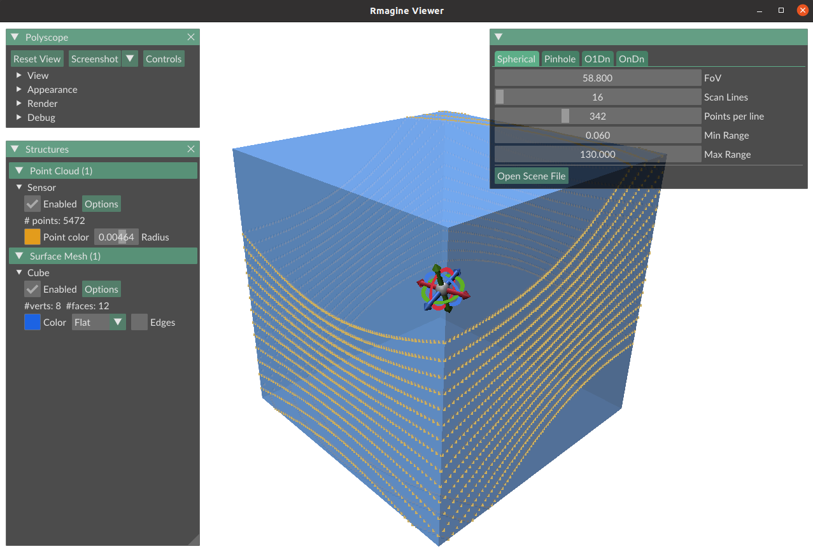

# rmagine_viewer

A viewer to demonstrate the basic functionalities of the [rmagine](https://github.com/uos/rmagine) library. Currently, only the Embree backend of rmagine is supported. Make sure Embree is installed properly. 

## Requirements

- Embree (>= v4.0.0)
- jsoncpp
- cmake >= 3.11

## Building

```bash
git clone https://github.com/amock/rmagine_viewer.git
cd rmagine_viewer
mkdir build
cd build
cmake ..
cmake --build .
```

<details>
<summary>
Output on my machine (Dell Latitude Laptop, no GPU):
</summary>

```bash
amock@amockhome:~$ git clone https://github.com/amock/rmagine_viewer.git
Cloning into 'rmagine_viewer'...
remote: Enumerating objects: 12, done.
remote: Counting objects: 100% (12/12), done.
remote: Compressing objects: 100% (9/9), done.
remote: Total 12 (delta 1), reused 0 (delta 0), pack-reused 0 (from 0)
Receiving objects: 100% (12/12), 8.20 KiB | 8.20 MiB/s, done.
Resolving deltas: 100% (1/1), done.
amock@amockhome:~$ cd rmagine_viewer/
amock@amockhome:~/rmagine_viewer$ mkdir build
amock@amockhome:~/rmagine_viewer$ cd build/
amock@amockhome:~/rmagine_viewer/build$ cmake ..
-- The C compiler identification is GNU 11.4.0
-- The CXX compiler identification is GNU 11.4.0
-- Detecting C compiler ABI info
-- Detecting C compiler ABI info - done
-- Check for working C compiler: /usr/bin/cc - skipped
-- Detecting C compile features
-- Detecting C compile features - done
-- Detecting CXX compiler ABI info
-- Detecting CXX compiler ABI info - done
-- Check for working CXX compiler: /usr/bin/c++ - skipped
-- Detecting CXX compile features
-- Detecting CXX compile features - done
-- CPM: Adding package rmagine@2.3.0 (v2.3.0)
-- Found OpenMP_C: -fopenmp (found version "4.5") 
-- Found OpenMP_CXX: -fopenmp (found version "4.5") 
-- Found OpenMP: TRUE (found version "4.5")  
-- Found PkgConfig: /usr/bin/pkg-config (found version "0.29.2") 
-- Checking for module 'jsoncpp'
--   Found jsoncpp, version 1.9.5
-- Looking for a CUDA compiler
-- Looking for a CUDA compiler - NOTFOUND
-- OptiX library not found
-- OptiX headers not found
-- Could not find OptiX
-- Include: OptiX_INCLUDE_DIR-NOTFOUND
-- Building Core. Library: rmagine
-- Building Ouster Component. Library: rmagine-ouster
-- Building Embree (4.3.0) backend. Library: rmagine-embree
-- Components being built:
-- - rmagine-core
-- - rmagine-ouster
-- - rmagine-embree
-- CPM: Adding package polyscope@2.4.0 (v2.4.0)
-- Looking for pthread.h
-- Looking for pthread.h - found
-- Performing Test CMAKE_HAVE_LIBC_PTHREAD
-- Performing Test CMAKE_HAVE_LIBC_PTHREAD - Success
-- Found Threads: TRUE  
-- Using X11 for window creation
-- Found X11: /usr/include   
-- Looking for XOpenDisplay in /usr/lib/x86_64-linux-gnu/libX11.so;/usr/lib/x86_64-linux-gnu/libXext.so
-- Looking for XOpenDisplay in /usr/lib/x86_64-linux-gnu/libX11.so;/usr/lib/x86_64-linux-gnu/libXext.so - found
-- Looking for gethostbyname
-- Looking for gethostbyname - found
-- Looking for connect
-- Looking for connect - found
-- Looking for remove
-- Looking for remove - found
-- Looking for shmat
-- Looking for shmat - found
-- Looking for IceConnectionNumber in ICE
-- Looking for IceConnectionNumber in ICE - found
-- GLM: Version 1.0.1
-- GLM: Build with C++ features auto detection
Polyscope backend openGL3_glfw enabled
-- Looking for C++ include EGL/egl.h
-- Looking for C++ include EGL/egl.h - found
-- CPM: Adding package portable-file-dialogs@0.1.0 (0.1.0)
-- Configuring done
-- Generating done
-- Build files have been written to: /home/amock/workspaces/rmagine_viewer/build
amock@amockhome:~/rmagine_viewer/build$ cmake --build .
[  1%] Building CXX object _deps/polyscope-build/deps/stb/CMakeFiles/stb.dir/stb_impl.cpp.o
[  1%] Linking CXX static library libstb.a
[  1%] Built target stb
[  1%] Building C object _deps/polyscope-build/deps/glad/src/CMakeFiles/glad.dir/glad.c.o
cc1: warning: command-line option ‘-std=c++17’ is valid for C++/ObjC++ but not for C
[  2%] Linking C static library libglad.a
[  2%] Built target glad
[  2%] Building C object _deps/polyscope-build/deps/glfw/src/CMakeFiles/glfw.dir/context.c.o
cc1: warning: command-line option ‘-std=c++17’ is valid for C++/ObjC++ but not for C
[  3%] Building C object _deps/polyscope-build/deps/glfw/src/CMakeFiles/glfw.dir/init.c.o
cc1: warning: command-line option ‘-std=c++17’ is valid for C++/ObjC++ but not for C
[  3%] Building C object _deps/polyscope-build/deps/glfw/src/CMakeFiles/glfw.dir/input.c.o
cc1: warning: command-line option ‘-std=c++17’ is valid for C++/ObjC++ but not for C
[  4%] Building C object _deps/polyscope-build/deps/glfw/src/CMakeFiles/glfw.dir/monitor.c.o
cc1: warning: command-line option ‘-std=c++17’ is valid for C++/ObjC++ but not for C
[  5%] Building C object _deps/polyscope-build/deps/glfw/src/CMakeFiles/glfw.dir/vulkan.c.o
cc1: warning: command-line option ‘-std=c++17’ is valid for C++/ObjC++ but not for C
[  5%] Building C object _deps/polyscope-build/deps/glfw/src/CMakeFiles/glfw.dir/window.c.o
cc1: warning: command-line option ‘-std=c++17’ is valid for C++/ObjC++ but not for C
[  6%] Building C object _deps/polyscope-build/deps/glfw/src/CMakeFiles/glfw.dir/x11_init.c.o
cc1: warning: command-line option ‘-std=c++17’ is valid for C++/ObjC++ but not for C
[  6%] Building C object _deps/polyscope-build/deps/glfw/src/CMakeFiles/glfw.dir/x11_monitor.c.o
cc1: warning: command-line option ‘-std=c++17’ is valid for C++/ObjC++ but not for C
[  7%] Building C object _deps/polyscope-build/deps/glfw/src/CMakeFiles/glfw.dir/x11_window.c.o
cc1: warning: command-line option ‘-std=c++17’ is valid for C++/ObjC++ but not for C
[  8%] Building C object _deps/polyscope-build/deps/glfw/src/CMakeFiles/glfw.dir/xkb_unicode.c.o
cc1: warning: command-line option ‘-std=c++17’ is valid for C++/ObjC++ but not for C
[  8%] Building C object _deps/polyscope-build/deps/glfw/src/CMakeFiles/glfw.dir/posix_time.c.o
cc1: warning: command-line option ‘-std=c++17’ is valid for C++/ObjC++ but not for C
[  9%] Building C object _deps/polyscope-build/deps/glfw/src/CMakeFiles/glfw.dir/posix_thread.c.o
cc1: warning: command-line option ‘-std=c++17’ is valid for C++/ObjC++ but not for C
[  9%] Building C object _deps/polyscope-build/deps/glfw/src/CMakeFiles/glfw.dir/glx_context.c.o
cc1: warning: command-line option ‘-std=c++17’ is valid for C++/ObjC++ but not for C
[ 10%] Building C object _deps/polyscope-build/deps/glfw/src/CMakeFiles/glfw.dir/egl_context.c.o
cc1: warning: command-line option ‘-std=c++17’ is valid for C++/ObjC++ but not for C
[ 11%] Building C object _deps/polyscope-build/deps/glfw/src/CMakeFiles/glfw.dir/osmesa_context.c.o
cc1: warning: command-line option ‘-std=c++17’ is valid for C++/ObjC++ but not for C
[ 11%] Building C object _deps/polyscope-build/deps/glfw/src/CMakeFiles/glfw.dir/linux_joystick.c.o
cc1: warning: command-line option ‘-std=c++17’ is valid for C++/ObjC++ but not for C
[ 12%] Linking C static library libglfw3.a
[ 12%] Built target glfw
[ 12%] Building CXX object _deps/polyscope-build/deps/glm/glm/CMakeFiles/glm.dir/detail/glm.cpp.o
[ 13%] Linking CXX static library libglm.a
[ 13%] Built target glm
[ 14%] Building CXX object _deps/polyscope-build/deps/imgui/CMakeFiles/imgui.dir/imgui/imgui.cpp.o
[ 14%] Building CXX object _deps/polyscope-build/deps/imgui/CMakeFiles/imgui.dir/imgui/imgui_draw.cpp.o
[ 15%] Building CXX object _deps/polyscope-build/deps/imgui/CMakeFiles/imgui.dir/imgui/imgui_tables.cpp.o
[ 15%] Building CXX object _deps/polyscope-build/deps/imgui/CMakeFiles/imgui.dir/imgui/imgui_widgets.cpp.o
[ 16%] Building CXX object _deps/polyscope-build/deps/imgui/CMakeFiles/imgui.dir/imgui/imgui_demo.cpp.o
[ 17%] Building CXX object _deps/polyscope-build/deps/imgui/CMakeFiles/imgui.dir/imgui/backends/imgui_impl_glfw.cpp.o
[ 17%] Building CXX object _deps/polyscope-build/deps/imgui/CMakeFiles/imgui.dir/imgui/backends/imgui_impl_opengl3.cpp.o
[ 18%] Linking CXX static library libimgui.a
[ 18%] Built target imgui
[ 18%] Building CXX object _deps/polyscope-build/src/CMakeFiles/polyscope.dir/polyscope.cpp.o
[ 19%] Building CXX object _deps/polyscope-build/src/CMakeFiles/polyscope.dir/options.cpp.o
[ 20%] Building CXX object _deps/polyscope-build/src/CMakeFiles/polyscope.dir/internal.cpp.o
[ 20%] Building CXX object _deps/polyscope-build/src/CMakeFiles/polyscope.dir/state.cpp.o
[ 21%] Building CXX object _deps/polyscope-build/src/CMakeFiles/polyscope.dir/structure.cpp.o
[ 21%] Building CXX object _deps/polyscope-build/src/CMakeFiles/polyscope.dir/quantity.cpp.o
[ 22%] Building CXX object _deps/polyscope-build/src/CMakeFiles/polyscope.dir/group.cpp.o
[ 23%] Building CXX object _deps/polyscope-build/src/CMakeFiles/polyscope.dir/utilities.cpp.o
[ 23%] Building CXX object _deps/polyscope-build/src/CMakeFiles/polyscope.dir/view.cpp.o
[ 24%] Building CXX object _deps/polyscope-build/src/CMakeFiles/polyscope.dir/screenshot.cpp.o
[ 24%] Building CXX object _deps/polyscope-build/src/CMakeFiles/polyscope.dir/messages.cpp.o
[ 25%] Building CXX object _deps/polyscope-build/src/CMakeFiles/polyscope.dir/pick.cpp.o
[ 26%] Building CXX object _deps/polyscope-build/src/CMakeFiles/polyscope.dir/widget.cpp.o
[ 26%] Building CXX object _deps/polyscope-build/src/CMakeFiles/polyscope.dir/render/engine.cpp.o
[ 27%] Building CXX object _deps/polyscope-build/src/CMakeFiles/polyscope.dir/render/color_maps.cpp.o
[ 27%] Building CXX object _deps/polyscope-build/src/CMakeFiles/polyscope.dir/render/ground_plane.cpp.o
[ 28%] Building CXX object _deps/polyscope-build/src/CMakeFiles/polyscope.dir/render/materials.cpp.o
[ 29%] Building CXX object _deps/polyscope-build/src/CMakeFiles/polyscope.dir/render/initialize_backend.cpp.o
[ 29%] Building CXX object _deps/polyscope-build/src/CMakeFiles/polyscope.dir/render/shader_builder.cpp.o
[ 30%] Building CXX object _deps/polyscope-build/src/CMakeFiles/polyscope.dir/render/managed_buffer.cpp.o
[ 30%] Building CXX object _deps/polyscope-build/src/CMakeFiles/polyscope.dir/render/templated_buffers.cpp.o
[ 31%] Building CXX object _deps/polyscope-build/src/CMakeFiles/polyscope.dir/disjoint_sets.cpp.o
[ 32%] Building CXX object _deps/polyscope-build/src/CMakeFiles/polyscope.dir/file_helpers.cpp.o
[ 32%] Building CXX object _deps/polyscope-build/src/CMakeFiles/polyscope.dir/camera_parameters.cpp.o
[ 33%] Building CXX object _deps/polyscope-build/src/CMakeFiles/polyscope.dir/histogram.cpp.o
[ 33%] Building CXX object _deps/polyscope-build/src/CMakeFiles/polyscope.dir/persistent_value.cpp.o
[ 34%] Building CXX object _deps/polyscope-build/src/CMakeFiles/polyscope.dir/color_management.cpp.o
[ 35%] Building CXX object _deps/polyscope-build/src/CMakeFiles/polyscope.dir/transformation_gizmo.cpp.o
[ 35%] Building CXX object _deps/polyscope-build/src/CMakeFiles/polyscope.dir/slice_plane.cpp.o
[ 36%] Building CXX object _deps/polyscope-build/src/CMakeFiles/polyscope.dir/weak_handle.cpp.o
[ 36%] Building CXX object _deps/polyscope-build/src/CMakeFiles/polyscope.dir/marching_cubes.cpp.o
[ 37%] Building CXX object _deps/polyscope-build/src/CMakeFiles/polyscope.dir/elementary_geometry.cpp.o
[ 38%] Building CXX object _deps/polyscope-build/src/CMakeFiles/polyscope.dir/point_cloud.cpp.o
[ 38%] Building CXX object _deps/polyscope-build/src/CMakeFiles/polyscope.dir/point_cloud_color_quantity.cpp.o
[ 39%] Building CXX object _deps/polyscope-build/src/CMakeFiles/polyscope.dir/point_cloud_scalar_quantity.cpp.o
[ 39%] Building CXX object _deps/polyscope-build/src/CMakeFiles/polyscope.dir/point_cloud_vector_quantity.cpp.o
[ 40%] Building CXX object _deps/polyscope-build/src/CMakeFiles/polyscope.dir/point_cloud_parameterization_quantity.cpp.o
[ 41%] Building CXX object _deps/polyscope-build/src/CMakeFiles/polyscope.dir/surface_mesh.cpp.o
[ 41%] Building CXX object _deps/polyscope-build/src/CMakeFiles/polyscope.dir/surface_color_quantity.cpp.o
[ 42%] Building CXX object _deps/polyscope-build/src/CMakeFiles/polyscope.dir/surface_scalar_quantity.cpp.o
[ 42%] Building CXX object _deps/polyscope-build/src/CMakeFiles/polyscope.dir/surface_vector_quantity.cpp.o
[ 43%] Building CXX object _deps/polyscope-build/src/CMakeFiles/polyscope.dir/surface_parameterization_quantity.cpp.o
[ 44%] Building CXX object _deps/polyscope-build/src/CMakeFiles/polyscope.dir/curve_network.cpp.o
[ 44%] Building CXX object _deps/polyscope-build/src/CMakeFiles/polyscope.dir/curve_network_color_quantity.cpp.o
[ 45%] Building CXX object _deps/polyscope-build/src/CMakeFiles/polyscope.dir/curve_network_scalar_quantity.cpp.o
[ 45%] Building CXX object _deps/polyscope-build/src/CMakeFiles/polyscope.dir/curve_network_vector_quantity.cpp.o
[ 46%] Building CXX object _deps/polyscope-build/src/CMakeFiles/polyscope.dir/volume_mesh.cpp.o
[ 47%] Building CXX object _deps/polyscope-build/src/CMakeFiles/polyscope.dir/volume_mesh_color_quantity.cpp.o
[ 47%] Building CXX object _deps/polyscope-build/src/CMakeFiles/polyscope.dir/volume_mesh_scalar_quantity.cpp.o
[ 48%] Building CXX object _deps/polyscope-build/src/CMakeFiles/polyscope.dir/volume_mesh_vector_quantity.cpp.o
[ 48%] Building CXX object _deps/polyscope-build/src/CMakeFiles/polyscope.dir/volume_grid.cpp.o
[ 50%] Building CXX object _deps/polyscope-build/src/CMakeFiles/polyscope.dir/volume_grid_scalar_quantity.cpp.o
[ 51%] Building CXX object _deps/polyscope-build/src/CMakeFiles/polyscope.dir/camera_view.cpp.o
[ 51%] Building CXX object _deps/polyscope-build/src/CMakeFiles/polyscope.dir/simple_triangle_mesh.cpp.o
[ 52%] Building CXX object _deps/polyscope-build/src/CMakeFiles/polyscope.dir/floating_quantity_structure.cpp.o
[ 52%] Building CXX object _deps/polyscope-build/src/CMakeFiles/polyscope.dir/floating_quantity.cpp.o
[ 53%] Building CXX object _deps/polyscope-build/src/CMakeFiles/polyscope.dir/image_quantity_base.cpp.o
[ 54%] Building CXX object _deps/polyscope-build/src/CMakeFiles/polyscope.dir/scalar_image_quantity.cpp.o
[ 54%] Building CXX object _deps/polyscope-build/src/CMakeFiles/polyscope.dir/color_image_quantity.cpp.o
[ 55%] Building CXX object _deps/polyscope-build/src/CMakeFiles/polyscope.dir/render_image_quantity_base.cpp.o
[ 55%] Building CXX object _deps/polyscope-build/src/CMakeFiles/polyscope.dir/depth_render_image_quantity.cpp.o
[ 56%] Building CXX object _deps/polyscope-build/src/CMakeFiles/polyscope.dir/color_render_image_quantity.cpp.o
[ 57%] Building CXX object _deps/polyscope-build/src/CMakeFiles/polyscope.dir/scalar_render_image_quantity.cpp.o
[ 57%] Building CXX object _deps/polyscope-build/src/CMakeFiles/polyscope.dir/raw_color_render_image_quantity.cpp.o
[ 58%] Building CXX object _deps/polyscope-build/src/CMakeFiles/polyscope.dir/raw_color_alpha_render_image_quantity.cpp.o
[ 58%] Building CXX object _deps/polyscope-build/src/CMakeFiles/polyscope.dir/imgui_config.cpp.o
[ 59%] Building CXX object _deps/polyscope-build/src/CMakeFiles/polyscope.dir/fullscreen_artist.cpp.o
[ 60%] Building CXX object _deps/polyscope-build/src/CMakeFiles/polyscope.dir/render/bindata/bindata_font_lato_regular.cpp.o
[ 60%] Building CXX object _deps/polyscope-build/src/CMakeFiles/polyscope.dir/render/bindata/bindata_font_cousine_regular.cpp.o
[ 61%] Building CXX object _deps/polyscope-build/src/CMakeFiles/polyscope.dir/render/bindata/concrete_seamless.cpp.o
[ 61%] Building CXX object _deps/polyscope-build/src/CMakeFiles/polyscope.dir/render/bindata/bindata_clay.cpp.o
[ 62%] Building CXX object _deps/polyscope-build/src/CMakeFiles/polyscope.dir/render/bindata/bindata_wax.cpp.o
[ 63%] Building CXX object _deps/polyscope-build/src/CMakeFiles/polyscope.dir/render/bindata/bindata_candy.cpp.o
[ 63%] Building CXX object _deps/polyscope-build/src/CMakeFiles/polyscope.dir/render/bindata/bindata_flat.cpp.o
[ 64%] Building CXX object _deps/polyscope-build/src/CMakeFiles/polyscope.dir/render/bindata/bindata_mud.cpp.o
[ 64%] Building CXX object _deps/polyscope-build/src/CMakeFiles/polyscope.dir/render/bindata/bindata_ceramic.cpp.o
[ 65%] Building CXX object _deps/polyscope-build/src/CMakeFiles/polyscope.dir/render/bindata/bindata_jade.cpp.o
[ 66%] Building CXX object _deps/polyscope-build/src/CMakeFiles/polyscope.dir/render/bindata/bindata_normal.cpp.o
[ 66%] Building CXX object _deps/polyscope-build/src/CMakeFiles/polyscope.dir/render/opengl/gl_engine.cpp.o
[ 67%] Building CXX object _deps/polyscope-build/src/CMakeFiles/polyscope.dir/render/opengl/gl_engine_glfw.cpp.o
[ 67%] Building CXX object _deps/polyscope-build/src/CMakeFiles/polyscope.dir/render/opengl/gl_engine_egl.cpp.o
[ 68%] Building CXX object _deps/polyscope-build/src/CMakeFiles/polyscope.dir/render/mock_opengl/mock_gl_engine.cpp.o
[ 69%] Building CXX object _deps/polyscope-build/src/CMakeFiles/polyscope.dir/render/opengl/shaders/texture_draw_shaders.cpp.o
[ 69%] Building CXX object _deps/polyscope-build/src/CMakeFiles/polyscope.dir/render/opengl/shaders/lighting_shaders.cpp.o
[ 70%] Building CXX object _deps/polyscope-build/src/CMakeFiles/polyscope.dir/render/opengl/shaders/grid_shaders.cpp.o
[ 70%] Building CXX object _deps/polyscope-build/src/CMakeFiles/polyscope.dir/render/opengl/shaders/ground_plane_shaders.cpp.o
[ 71%] Building CXX object _deps/polyscope-build/src/CMakeFiles/polyscope.dir/render/opengl/shaders/gizmo_shaders.cpp.o
[ 72%] Building CXX object _deps/polyscope-build/src/CMakeFiles/polyscope.dir/render/opengl/shaders/histogram_shaders.cpp.o
[ 72%] Building CXX object _deps/polyscope-build/src/CMakeFiles/polyscope.dir/render/opengl/shaders/surface_mesh_shaders.cpp.o
[ 73%] Building CXX object _deps/polyscope-build/src/CMakeFiles/polyscope.dir/render/opengl/shaders/volume_mesh_shaders.cpp.o
[ 73%] Building CXX object _deps/polyscope-build/src/CMakeFiles/polyscope.dir/render/opengl/shaders/vector_shaders.cpp.o
[ 74%] Building CXX object _deps/polyscope-build/src/CMakeFiles/polyscope.dir/render/opengl/shaders/sphere_shaders.cpp.o
[ 75%] Building CXX object _deps/polyscope-build/src/CMakeFiles/polyscope.dir/render/opengl/shaders/ribbon_shaders.cpp.o
[ 75%] Building CXX object _deps/polyscope-build/src/CMakeFiles/polyscope.dir/render/opengl/shaders/cylinder_shaders.cpp.o
[ 76%] Building CXX object _deps/polyscope-build/src/CMakeFiles/polyscope.dir/render/opengl/shaders/rules.cpp.o
[ 76%] Building CXX object _deps/polyscope-build/src/CMakeFiles/polyscope.dir/render/opengl/shaders/common.cpp.o
[ 77%] Linking CXX static library libpolyscope.a
[ 77%] Built target polyscope
[ 78%] Building CXX object _deps/rmagine-build/src/rmagine_core/CMakeFiles/rmagine-core.dir/__/__/__/__/tmp/core/version.cpp.o
[ 78%] Building CXX object _deps/rmagine-build/src/rmagine_core/CMakeFiles/rmagine-core.dir/src/map/AssimpIO.cpp.o
[ 79%] Building CXX object _deps/rmagine-build/src/rmagine_core/CMakeFiles/rmagine-core.dir/src/math/memory_math.cpp.o
[ 79%] Building CXX object _deps/rmagine-build/src/rmagine_core/CMakeFiles/rmagine-core.dir/src/math/linalg.cpp.o
[ 80%] Building CXX object _deps/rmagine-build/src/rmagine_core/CMakeFiles/rmagine-core.dir/src/math/statistics.cpp.o
[ 81%] Building CXX object _deps/rmagine-build/src/rmagine_core/CMakeFiles/rmagine-core.dir/src/math/optimization.cpp.o
[ 81%] Building CXX object _deps/rmagine-build/src/rmagine_core/CMakeFiles/rmagine-core.dir/src/types/Memory.cpp.o
[ 82%] Building CXX object _deps/rmagine-build/src/rmagine_core/CMakeFiles/rmagine-core.dir/src/types/conversions.cpp.o
[ 82%] Building CXX object _deps/rmagine-build/src/rmagine_core/CMakeFiles/rmagine-core.dir/src/types/sensors.cpp.o
[ 83%] Building CXX object _deps/rmagine-build/src/rmagine_core/CMakeFiles/rmagine-core.dir/src/types/mesh_types.cpp.o
[ 84%] Building CXX object _deps/rmagine-build/src/rmagine_core/CMakeFiles/rmagine-core.dir/src/util/synthetic.cpp.o
[ 84%] Building CXX object _deps/rmagine-build/src/rmagine_core/CMakeFiles/rmagine-core.dir/src/util/assimp/helper.cpp.o
[ 85%] Building CXX object _deps/rmagine-build/src/rmagine_core/CMakeFiles/rmagine-core.dir/src/util/IDGen.cpp.o
[ 85%] Building CXX object _deps/rmagine-build/src/rmagine_core/CMakeFiles/rmagine-core.dir/src/util/exceptions.cpp.o
[ 86%] Building CXX object _deps/rmagine-build/src/rmagine_core/CMakeFiles/rmagine-core.dir/src/noise/Noise.cpp.o
[ 87%] Building CXX object _deps/rmagine-build/src/rmagine_core/CMakeFiles/rmagine-core.dir/src/noise/GaussianNoise.cpp.o
[ 87%] Building CXX object _deps/rmagine-build/src/rmagine_core/CMakeFiles/rmagine-core.dir/src/noise/RelGaussianNoise.cpp.o
[ 88%] Building CXX object _deps/rmagine-build/src/rmagine_core/CMakeFiles/rmagine-core.dir/src/noise/UniformDustNoise.cpp.o
[ 88%] Linking CXX shared library ../../../../lib/librmagine-core.so
[ 88%] Built target rmagine-core
[ 88%] Building CXX object _deps/rmagine-build/src/rmagine_ouster/CMakeFiles/rmagine-ouster.dir/src/types/ouster_sensors.cpp.o
[ 89%] Linking CXX shared library ../../../../lib/librmagine-ouster.so
[ 89%] Built target rmagine-ouster
[ 90%] Building CXX object _deps/rmagine-build/src/rmagine_embree/CMakeFiles/rmagine-embree.dir/src/map/embree/EmbreeDevice.cpp.o
[ 91%] Building CXX object _deps/rmagine-build/src/rmagine_embree/CMakeFiles/rmagine-embree.dir/src/map/embree/EmbreeGeometry.cpp.o
[ 91%] Building CXX object _deps/rmagine-build/src/rmagine_embree/CMakeFiles/rmagine-embree.dir/src/map/embree/EmbreeMesh.cpp.o
[ 92%] Building CXX object _deps/rmagine-build/src/rmagine_embree/CMakeFiles/rmagine-embree.dir/src/map/embree/EmbreeScene.cpp.o
[ 92%] Building CXX object _deps/rmagine-build/src/rmagine_embree/CMakeFiles/rmagine-embree.dir/src/map/embree/EmbreeInstance.cpp.o
[ 93%] Building CXX object _deps/rmagine-build/src/rmagine_embree/CMakeFiles/rmagine-embree.dir/src/map/embree/EmbreePoints.cpp.o
[ 94%] Building CXX object _deps/rmagine-build/src/rmagine_embree/CMakeFiles/rmagine-embree.dir/src/map/embree/embree_shapes.cpp.o
[ 94%] Building CXX object _deps/rmagine-build/src/rmagine_embree/CMakeFiles/rmagine-embree.dir/src/map/EmbreeMap.cpp.o
[ 95%] Building CXX object _deps/rmagine-build/src/rmagine_embree/CMakeFiles/rmagine-embree.dir/src/simulation/SimulatorEmbree.cpp.o
[ 95%] Building CXX object _deps/rmagine-build/src/rmagine_embree/CMakeFiles/rmagine-embree.dir/src/simulation/SphereSimulatorEmbree.cpp.o
[ 96%] Building CXX object _deps/rmagine-build/src/rmagine_embree/CMakeFiles/rmagine-embree.dir/src/simulation/PinholeSimulatorEmbree.cpp.o
[ 97%] Building CXX object _deps/rmagine-build/src/rmagine_embree/CMakeFiles/rmagine-embree.dir/src/simulation/O1DnSimulatorEmbree.cpp.o
[ 97%] Building CXX object _deps/rmagine-build/src/rmagine_embree/CMakeFiles/rmagine-embree.dir/src/simulation/OnDnSimulatorEmbree.cpp.o
[ 98%] Linking CXX shared library ../../../../lib/librmagine-embree.so
[ 98%] Built target rmagine-embree
[100%] Building CXX object CMakeFiles/rmagine_viewer.dir/src/rmagine_viewer.cpp.o
[100%] Linking CXX executable rmagine_viewer
[100%] Built target rmagine_viewer
```

</details>


## Running

After building, run the rmagine_viewer by entering 

```console
./rmagine_viewer
```



You can navigate around and switch the type of the sensor to Spherical, Pinhole, O1Dn or OnDn and change the parameters. O1Dn supports loading an Ouster's meta yaml file.

## Rmagine and FetchContent_Declare

This repository also shows a very easy way to integrate rmagine into your projects utilizing [CPM](https://github.com/cpm-cmake/CPM.cmake), a package manager for cmake. Read the [CMakeLists.txt](./CMakeLists.txt) for more information. 

## Acknowledgements

This viewer is based on the amazing project [Polyscope](https://github.com/nmwsharp/polyscope) by [Nicholas Sharp](https://github.com/nmwsharp).